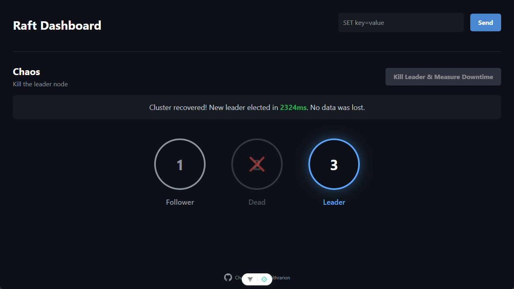
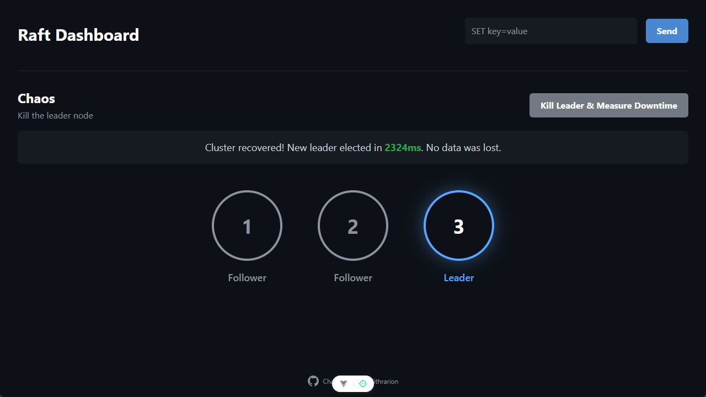
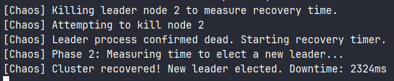
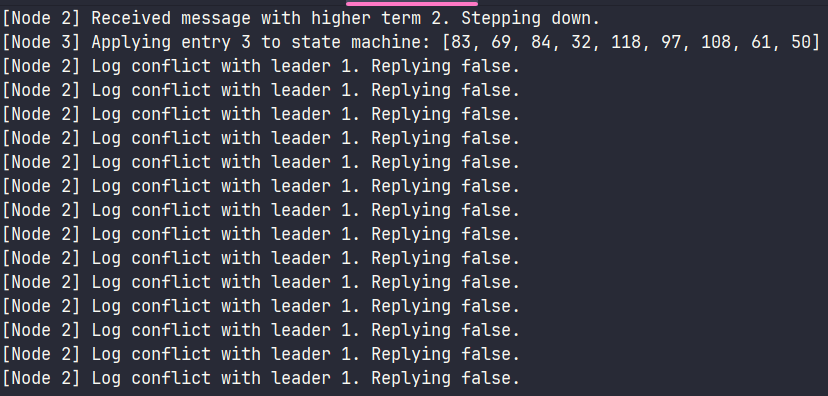

### chaos raft

a study of the [raft](https://raft.github.io/) distributed consensus algorithm, implemented from scratch in rust.  
includes an actor model for nodes, wal, a dashboard to kill the leader, and a split-brain test.





### features
*   **core raft:** leader election, log replication, heartbeats
*   **wal (write-ahead log):** state is persisted to disk
*   **self-healing:** nodes automatically recover, rejoin the cluster, and sync logs from the leader
*   **visualizer:** real-time dashboard (tauri + vue)
*   **actor-model:** using mpsc channels
*   **kill node button:** kill the leader via ui and measure recovery time
*   **log compaction + test:** snapshotting implementation to prevent infinite log growth (was tough to debug)
*   **split-brain test:** simulated network partitions proving split-brain resilience (jepsen-style test)

#### todo
*   **dynamic membership:** add/remove nodes on the fly
*   **optimizations:** maybe batching or pipelining for performance
*   **client stuff:** leader redirection
*   **code todos:** stuff like refactoring load_log and use zerocopy instead of shared buffer. + replace useInterval pooling on frontend with proper events. + use mpsc instead of mutexes for tcp network connections

### how to run

#### 1. cluster + ui
```bash
# terminal 1 (wsl) (backend cluster):
./start_cluster.sh

# terminal 2:
pnpm tauri dev
```

oh nice infinite logs
